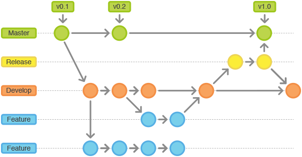

https://blog.csdn.net/u012562943/article/details/79754587
# git-flow

## 1. 什么是git-flow?
git-flow 是基于git的工作流程
git flow是一套基于git的工作流程。Git flow 可以工作在 OSX, Linux 和 Windows之下。这个工作流程围绕着project的发布(release)定义了一个严格的如何建立分支的模型。git-flow 并不是要替代 Git，它仅仅是非常聪明有效地把标准的 Git 命令用脚本组合了起来。
严格来讲，你并不需要安装什么特别的东西就可以使用 git-flow 工作流程。你只需要了解，哪些工作流程是由哪些单独的任务所组成的，并且附带上正确的参数，以及在一个正确的顺序下简单执行那些对应的 Git 命令就可以了。当然，如果你使用 git-flow 脚本就会更加方便了，你就不需要把这些命令和顺序都记在脑子里。
原理：流程仍然使用一个中央代码仓库，它是所有开发者的信息交流中心。跟其他的工作流程一样，开发者在本地完成开发，然后再将分支代码推送到中央仓库。唯一不同的是项目中分支的结构。

## 2.这样的好处
* 还处于半成品状态的feature不会影响到主干
* 各个开发人员之间做自己的分支，互不干扰
* 主干永远处于可编译、可运行的状态

## 3. git-flow中的分支
### （1）主分支：

* master分支   
master分支上的代码是可以随时发布到生存环境中的代码(production-ready)，每次提交到master的代码都必须打上标签标示版本号。master分支的操作权限应该由专门的人负责。
* develop分支  
我们称为开发分支，又称集成分支(integration branch)，辅助分支完成自己的开发之后都会合并到develop分支，确定要把当前已经集成的功能发布一个版本的时候，就需要把devlop分支合并到master分支（下面会介绍中间其实还有一个release分支），并打上带版本号的标签。

### （2）功能开发的分支 Feature
每一个新功能的开发都应该各自使用独立的分支。为了备份或便于团队之间的合作，这种分支也可以被推送到中央仓库。但是，在创建新的功能开发分支时，父分支应该选择develop（而不是master）。当功能开发完成时，改动的代码应该被合并（merge）到develop分支。功能开发永远不应该直接牵扯到master。

### （3）用于发布的分支 Release
一旦develop分支积聚了足够多的新功能（或者预定的发布日期临近了），你可以基于develop分支建立一个用于产品发布的分支。这个分支的创建意味着一个发布周期的开始，也意味着本次发布不会再增加新的功能——在这个分支上只能修复bug，做一些文档工作或者跟发布相关的任务。在一切准备就绪的时候，这个分支会被合并入master，并且用版本号打上标签。另外，发布分支上的改动还应该合并入develop分支——在发布周期内，develop分支仍然在被使用（一些开发者会把其他功能集成到develop分支）。使用专门的一个分支来为发布做准备的好处是，在一个团队忙于当前的发布的同时，另一个团队可以继续为接下来的一次发布开发新功能。

### （4）用于维护的分支 Hotfix   
发布后的维护工作或者紧急问题的快速修复也需要使用一个独立的分支。这是唯一一种可以直接基于master创建的分支。一旦问题被修复了，所做的改动应该被合并入master和develop分支（或者用于当前发布的分支）。在这之后，master上还要使用更新的版本号打好标签。  
  

## merge成本问题
合并冲突在使用 Git Flow 是非常常见。原因很简单：如果你有多个并行功能分支，他们长时间存在，那么很可能在代码库的相同部分在两个不同的分支中被更改。合并冲突不仅对于需要手动解决的开发人员来说是令人沮丧的。这也增加了在代码中破坏某些功能的风险，因为当你不得不决定使用哪个版本代码时，很容易犯错。即使你把一个分支合并到另一个分支时你做的都是正确的，可能也会发生这两个特性的组合影响了你的代码。
**<u>这种不可预测的冲突和影响，将会导致发布时间不可预测。</u>**

## 持续集成问题
要解决以上问题，我们就得持续集成dev分支的代码，这得确保不同feature分支及时的将功能合并到dev分支。问题是两个feature的开发周期都很长，导致这两个feature都长时间集成不到对方的功能，产生merge成本问题。

## 我们的项目
由于我们的团队人员较少，沟通方便，完全按照git-flow的流程稍显复杂。  
1. 一天能完成的功能，不需要的建立feature分支，直接在dev分支上进行修改，提交。
2. 开发周期较长，较为独立的功能，在feature分支中进行。注意在开发周期内持续集成dev分支中的功能。
3. dev分支中待发布功能都已集成时，或者大部分集成时，拉出release分支，提交测试。然后有需要的话，及时往release分支集成。

## git-flow 演示
可以基于git flow 命令，也可以直接用git 命令  

# Aone Flow

## 1.开始工作前，从主干创建特性分支
每当开始一件新的工作项（比如新的功能或是待解决的问题）的时候，从代表最新已发布版本的主干上创建一个通常以feature/前缀命名的特性分支，然后在这个分支上提交代码修改。也就是说，每个工作项（可以是一个人完成，或是多个人协作完成）对应一个特性分支，所有的修改都不允许直接提交到主干。

## 2.通过合并特性分支，形成发布分支
GitFlow 先将已经完成的特性分支合并回公共主线（即开发分支），然后从公共主线拉出发布分支。TrunkBased 同样是等所有需要的特性都在主干分支上开发完成，然后从主干分支的特定位置拉出发布分支。而 AoneFlow 的思路是，从主干上拉出一条新分支，将所有本次要集成或发布的特性分支依次合并过去，从而得到发布分支。发布分支通常以release/前缀命名。

## 3.发布到线上正式环境后，合并相应的发布分支到主干，在主干添加标签，同时删除该发布分支关联的特性分支
当一条发布分支上的流水线完成了一次线上正式环境的部署，就意味着相应的功能真正的发布了，此时应该将这条发布分支合并到主干。为了避免在代码仓库里堆积大量历史上的特性分支，还应该清理掉已经上线部分特性分支。与 GitFlow 相似，主干分支上的最新版本始终与线上版本一致，如果要回溯历史版本，只需在主干分支上找到相应的版本标签即可。

## 其他工作流
* Trunk Based Development
* Aone Flow
* GitHub Flow
* GitLab Flow

