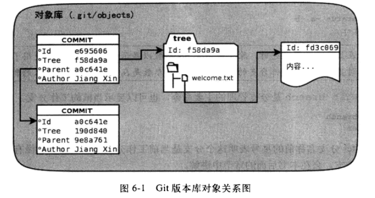
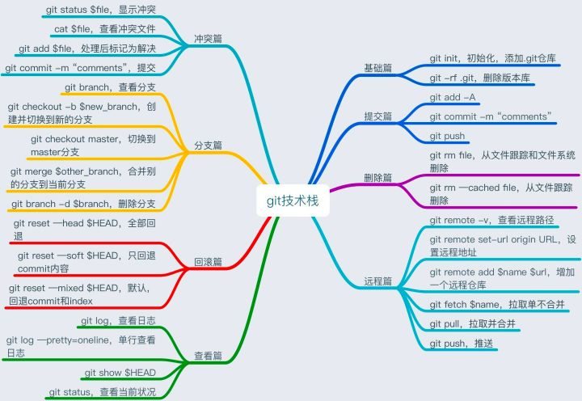
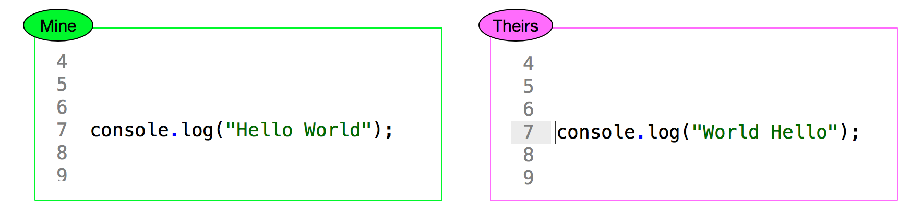
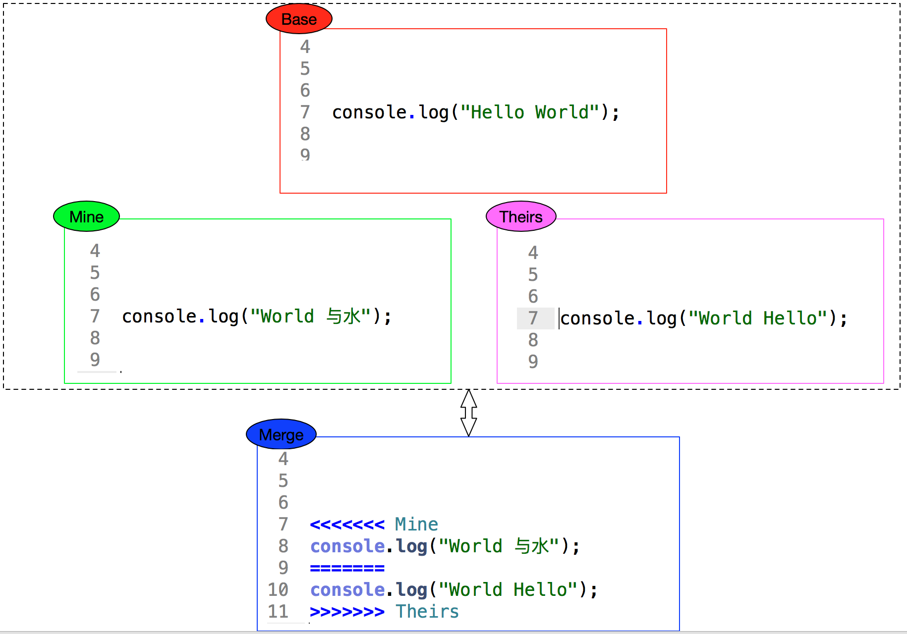
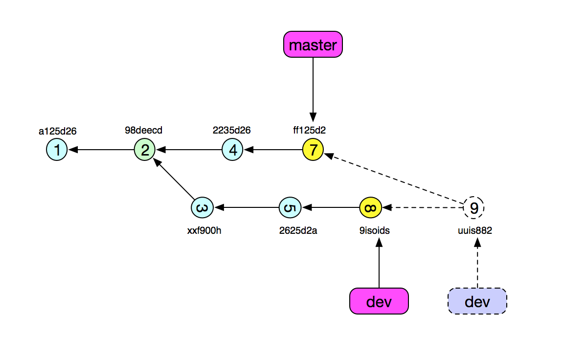

# 简介
   同生活中的许多伟大事件一样，Git 诞生于一个极富纷争大举创新的年代。Linux 内核开源项目有着为数众广的参与者。绝大多数的 Linux 内核维护工作都花在了提交补丁和保存归档的繁琐事务上（1991－2002年间）。到 2002 年，整个项目组开始启用分布式版本控制系统 BitKeeper 来管理和维护代码。到了 2005 年，开发 BitKeeper 的商业公司同 Linux 内核开源社区的合作关系结束，他们收回了免费使用 BitKeeper 的权力。这就迫使 Linux 开源社区（特别是 Linux 的缔造者 Linus Torvalds ）不得不吸取教训，只有开发一套属于自己的版本控制系统才不至于重蹈覆辙。
自诞生于 2005 年以来，Git 日臻成熟完善，在高度易用的同时，仍然保留着初期设定的目标。它的速度飞快，极其适合管理大项目，它还有着令人难以置信的非线性分支管理系统，可以应付各种复杂的项目开发需求。  
  
  # Git 优点
  * 分布式版本控制系统
  * 完整的log
  * 分支成本低
  * 可靠性高
  * 直接记录快照，而非差异比较
  * 几乎所有操作都是本地执行的
  * 时刻保持数据完整

# Git 仓库

# Git 的基本流程
* 在工作区修改内容
* 对修改后的文件进行快照， 然后保存到暂存区
* 提交更新，将保存在暂存区的文件快照永久存储到git目录中

# .git目录介绍
* hooks  --git 相关钩子
* Info  --包含一些仓库的信息
* Objects --git 本地仓库里的所有对象（commits, trees, blobs, tags）
* refs  --记录项目中每个分支对应的commit
* logs --日志信息
* configs --配置信息
* description -- 项目描述
* index -- 暂存区的内容
* HEAD  --当前分支

# 暂存区
git ls-files --stage

# Git objects
git cat-file -p commitid

* Blobs 只包含文件内容
* Trees 目录的信息，包含了此目录下的blobs
* Commits 一个提交的所有元数据
* Tags  tag用于给某个上述类型的对象指配一个便于开发者记忆的名字, 通常用于某次commit  

# 常用命令

# merge 策略  
1. 基础
git 合并文件是以行为单位进行一行一行进行合并的，但是有些时候并不是两行内容不一样git就会报冲突，因为smart git 会帮我们自动帮我们进行取舍，分析出那个结果才是我们所期望的，如果smart git 都无法进行取舍时候才会报冲突，这个时候才需要我们进行人工干预。
2. 二路合并
二路合并算法就是讲两个文件进行逐行对别，如果行内容不同就报冲突。

3. 三路合并
三路合并就是先找出一个基准，然后以基准为Base 进行合并，如果2个文件相对基准(base)都发生了改变 那git 就报冲突，然后让你人工决断。否则，git将取相对于基准(base)变化的那个为最终结果。 

3. 分支的merge

需要把master分支的更新合并到dev分支上，本质上就是合并修改集 7(Mine) 和 8(Theirs) ，此时我们要 利用DAG(有向无环图)相关算法找到我们公共的祖先 2（Base）然后进行三方合并，最后合并生成 9,然后dev的HEAD指向9

# git merge 与 git rebase
git rebase
  

这些命令会把你的"mywork"分支里的每个提交(commit)取消掉，并且把它们临时 保存为补丁(patch)(这些补丁放到".git/rebase"目录中),然后把"mywork"分支更新 为最新的"origin"分支，最后把保存的这些补丁应用到"mywork"分支上。当'mywork'分支更新之后，它会指向这些新创建的提交(commit),而那些老的提交会被丢弃。 如果运行垃圾收集命令(pruning garbage collection), 这些被丢弃的提交就会删除.

git merge应该只用于为了保留一个有用的，语义化的准确的历史信息，而希望将一个分支的整个变更集成到另外一个branch时使用。这样形成的清晰版本变更图有着重要的价值。
git rebase 当你想保持当前分支历史记录的不受影响。注意不要在公共仓库
