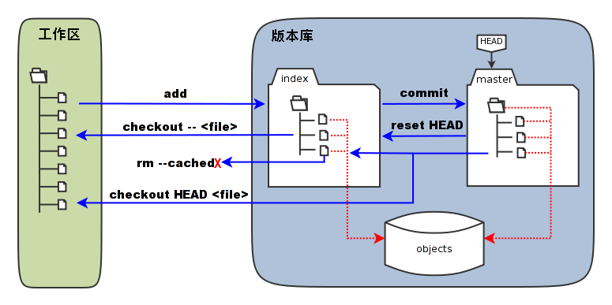

# 简介
   同生活中的许多伟大事件一样，Git 诞生于一个极富纷争大举创新的年代。Linux 内核开源项目有着为数众广的参与者。绝大多数的 Linux 内核维护工作都花在了提交补丁和保存归档的繁琐事务上（1991－2002年间）。到 2002 年，整个项目组开始启用分布式版本控制系统 BitKeeper 来管理和维护代码。到了 2005 年，开发 BitKeeper 的商业公司同 Linux 内核开源社区的合作关系结束，他们收回了免费使用 BitKeeper 的权力。这就迫使 Linux 开源社区（特别是 Linux 的缔造者 Linus Torvalds ）不得不吸取教训，只有开发一套属于自己的版本控制系统才不至于重蹈覆辙。
自诞生于 2005 年以来，Git 日臻成熟完善，在高度易用的同时，仍然保留着初期设定的目标。它的速度飞快，极其适合管理大项目，它还有着令人难以置信的非线性分支管理系统，可以应付各种复杂的项目开发需求。  
  
  # Git 优点
  * 分布式版本控制系统
  * 完整的log
  * 分支成本低
  * 可靠性高
  * 直接记录快照，而非差异比较
  * 几乎所有操作都是本地执行的
  * 时刻保持数据完整

# Git 仓库

# Git 的基本流程
* 在工作区修改内容
* 对修改后的文件进行快照， 然后保存到暂存区
* 提交更新，将保存在暂存区的文件快照永久存储到git目录中

# .git目录介绍
* hooks  --git 相关钩子
* Info  --包含一些仓库的信息
* Objects --git 本地仓库里的所有对象（commits, trees, blobs, tags）
* refs  --记录项目中每个分支对应的commit
* logs --日志信息
* configs --配置信息
* description -- 项目描述
* index -- 暂存区的内容
* HEAD  --当前分支

# 暂存区
git ls-files --stage

# Git objects
git cat-file -p commitid

* Blobs 只包含文件内容
* Trees 目录的信息，包含了此目录下的blobs
* Commits 一个提交的所有元数据
* Tags  tag用于给某个上述类型的对象指配一个便于开发者记忆的名字, 通常用于某次commit  

